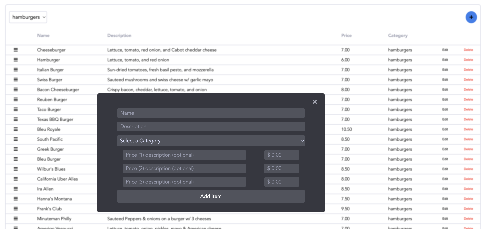

<!-- PROJECT LOGO -->
<br />
<p align="center">
  <a href="https://burger-barn-1827.herokuapp.com/">
    <h1>Burger Barn</h1>
    
  </a>

  <p align="center">
    The unofficial website for Burger Barn located in Jeffersonville, Vermont
  </p>
</p>


<!-- TABLE OF CONTENTS -->
<details open="open">
  <summary><h2 style="display: inline-block">Table of Contents</h2></summary>
  <ol>
    <li>
      <a href="#about-the-project">About The Project</a>
      <ul>
        <li><a href="#built-with">Built With</a></li>
      </ul>
    </li>
    <li>
      <a href="#getting-started">Getting Started</a>
      <ul>
        <li><a href="#prerequisites">Prerequisites</a></li>
        <li><a href="#installation">Installation</a></li>
        <li><a href="#configuration">Configuration</a></li>
        <li><a href="#running-the-app">Running the app</a></li>
      </ul>
    </li>
    <li><a href="#roadmap">Roadmap</a></li>
    <li><a href="#contributing">Contributing</a></li>
    <li><a href="#contact">Contact</a></li>
  </ol>
</details>


<!-- ABOUT THE PROJECT -->
## About The Project

Built on the MERN stack, this app shows all the details of Burger Barn and provides a UI to edit the Burger Barn menu.

### Built With

* [React](https://reactjs.org/)

<!-- GETTING STARTED -->
## Getting Started

To get a local copy up and running follow these simple steps.

### Prerequisites

Install the latest version of [Node.js](https://nodejs.org/en/) (if you do not already have it)

### Installation

1. Open a new terminal
2. Clone the repo
   ```sh
   git clone https://github.com/nme077/burger-barn.git
   ```
2. Navigate to the project directory in the terminal
    ```sh
    cd burger-barn
    ```
3. Install NPM packages
   ```sh
   npm install
   ```
   
### Configuration

1. Add a `.env` file with the variables in [.env.example](.env.example). *Note: Skip `ADMIN_USER_ID` for now, it will be described later on.*

2. Connect to MongoDB - get started with MongoDB Atlas at https://docs.atlas.mongodb.com/getting-started/
  - Obtain the unique URI to connect to your MongoDB database add it to your .env file.
  ```sh
  URI="mongodb://[username:password@]host1[:port1][,...hostN[:portN]][/[defaultauthdb][?options]]"
  ```

3. Navigate to the ``'/register'`` in `app.js`.

4. Comment out the code between the ```// Comment out logic to test``` comment and replace it with the following. *This will allow an admin user to be created without a token being created by an authorized administrator.*
```
// Unprotected registration logic for testing
    User.register(new User(userInfo), req.body.password, (err) => {
        if(err) return res.json({error: err.message});
    
        passport.authenticate('local', (err, user, info) => {
            if(err) return res.json({error: err});
            if(!user) return res.json({error: info});
            req.logIn(user, err => {
                if(err) return res.json({error: err});
                return res.json({success: 'You are now logged in!'});
            })
        })(req, res, next);
    });
```
5. In a browser, navigate to http://localhost:3000/register and enter the required info. *Note: token is required here, but you can enter any value in this intial step.* 

6. Revert the code we modified in step 5 to the original.

7. Add the ObjectId of the user you created to a `.env` file as `ADMIN_USER_ID`

<!-- RUN THE APP -->
## Running the app

1. Within the `burger-barn` directory, run ```npm start```
2. Open a second terminal and enter ```cd client```
3. Run ```npm start```
4. In a browser, navigate to http://localhost:3000/admin and add some menu items.
  
5. Navigate to http://localhost:3000/ to see the results!


<!-- ROADMAP -->
## Roadmap

See the [open issues](https://github.com/nme077/burger-barn/issues) for a list of proposed features (and known issues).


<!-- CONTRIBUTING -->
## Contributing

Contributions are what make the open source community such an amazing place to be learn, inspire, and create. Any contributions you make are **greatly appreciated**.

1. Fork the Project
2. Create your Feature Branch (`git checkout -b feature/AmazingFeature`)
3. Commit your Changes (`git commit -m 'Add some AmazingFeature'`)
4. Push to the Branch (`git push origin feature/AmazingFeature`)
5. Open a Pull Request


<!-- CONTACT -->
## Contact

Nicholas Eveland - nicholaseveland93@gmail.com

Project Link: [https://github.com/nme077/burger-barn](https://github.com/nme077/burger-barn)
